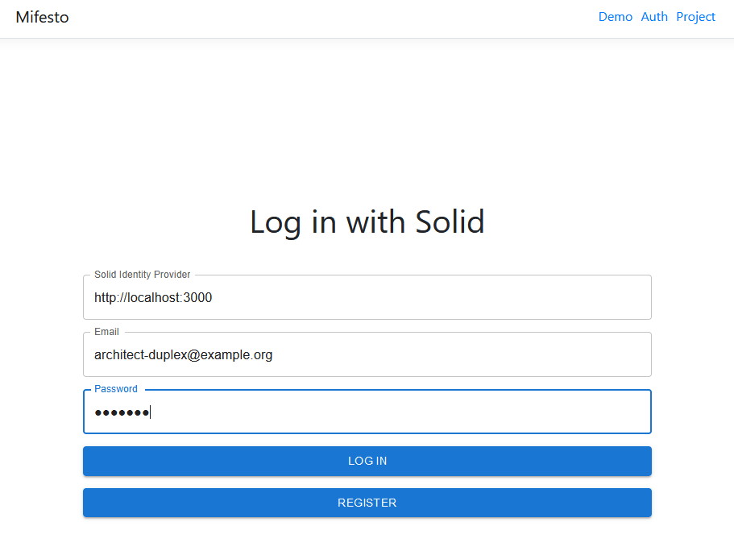

# Mifesto: Auth Page
This is a micro-frontend module that provides a page for authentication with Solid. At this point in time, the [Community Solid Server](https://github.com/CommunitySolidServer/CommunitySolidServer) must be used (tested with v3) for demo purposes. To log in with Solid, you need to indicate the URL of your Solid Identity Provider, along with the e-mail address you registered with and your password. The module will then attempt to log you in and provide you with a JSON Web token. This token can be used to authenticate with other micro-frontend modules.

## About Mifesto
Mifesto (Micro-Frontend Store) is an experimental framework for federation of micro-frontends. It is a work in progress and is not yet ready for production use. Micro-frontend modules expose the following: 

* a manifest file that describes the module and its dependencies
* loadable code which may be injected into a "bundler" application

The bundler application is responsible for loading the micro-frontend modules and providing a framework for them to interact with each other. The bundler application is also responsible for providing an interface for the micro-frontend modules to render into. Mifesto modules may or may not be compatible with the [ConSolid ecosystem](https://content.iospress.com/articles/semantic-web/sw233396), or generally with AEC multi-models. To be useful for interacting with multi-models, a minimal functionality is required. This functionality is described in the [Mifesto documentation]().
